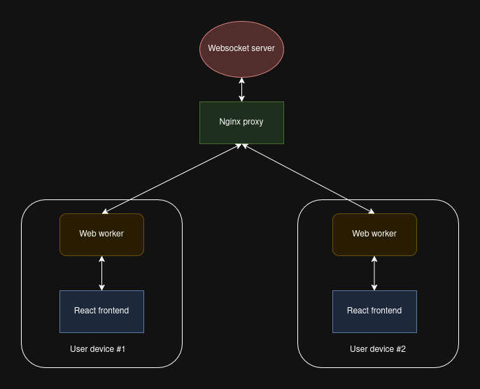

# Architecture

## Overview
The architecture is based on one server connecting multiple clients using websocket connections between the server and clients. All communication between client is done via the backend server.

*Diagram of the current architecture*

## Architecture reasoning

### Websocket

The choice of using Websocket in this project is to be able to use real time communication between multiple clients. Websocket also provides the opportunity to easily increase the amount of possible players in the future. Please consult the official IETF documentation for WebSocket for the most up to date details of the Websocket protocol: https://datatracker.ietf.org/doc/html/rfc6455

### Web workers

The project implements web workers on the frontend to assist with guaranteeing stable performance. The web workers in this project are responsible for handling communication with the backend server using Websocket. This allows all communication with the backend to run on a separate thread, allowing the browser to focus on other demanding tasks such as the rendering of the Graphics.

### Proxies

Reverse proxies are implemented to add a certain level of security by obscurity and for allowing the possibility of adding load balancers in the future, if the backend were the be hosted over a Kubernetes cluster.